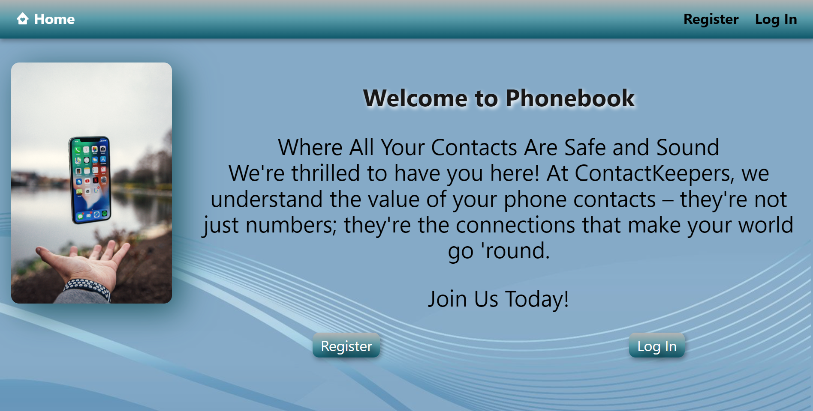
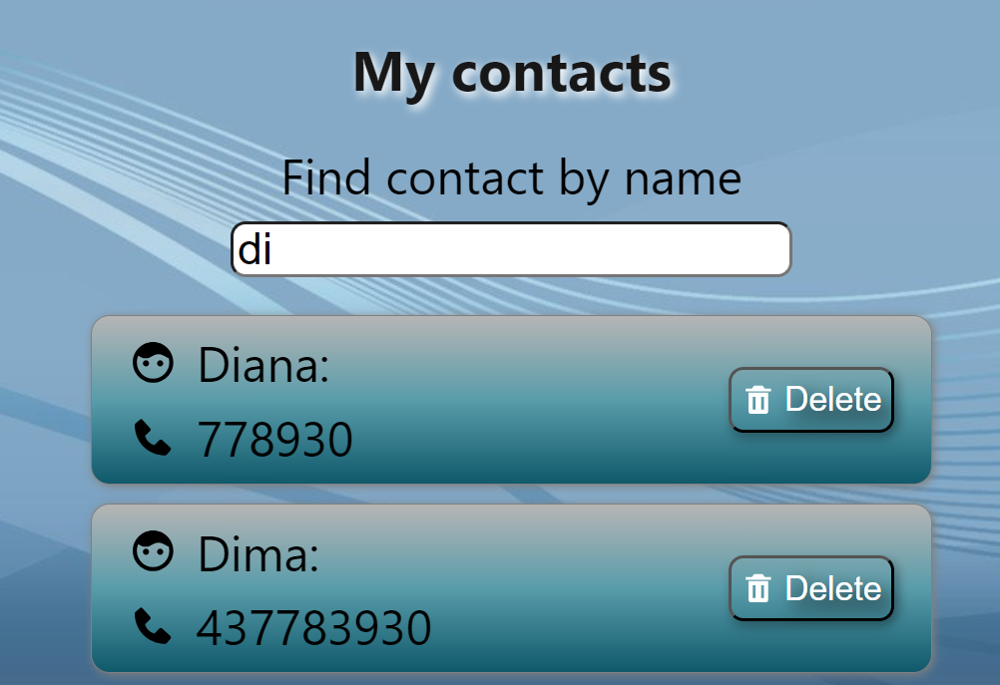
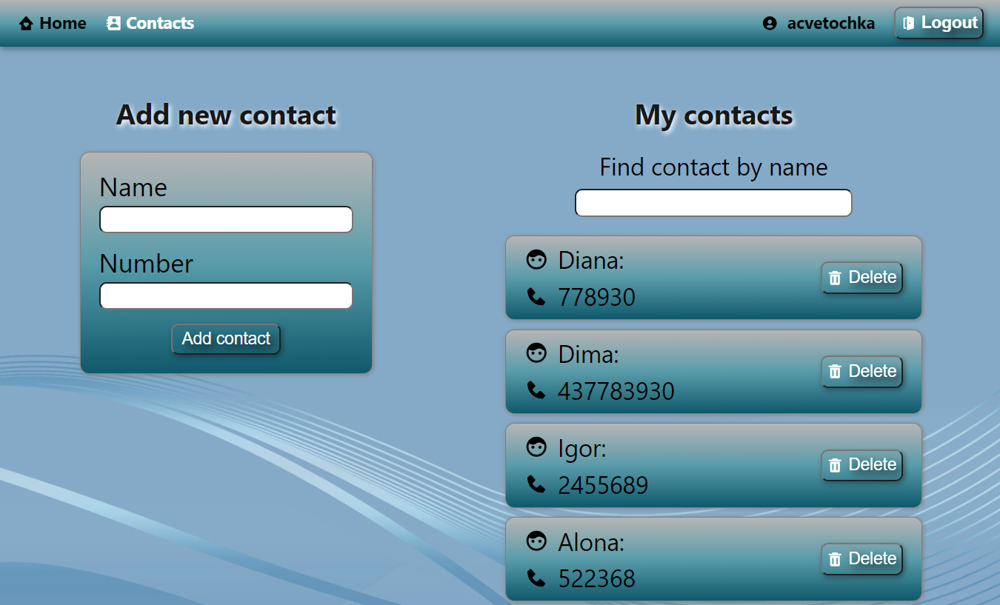
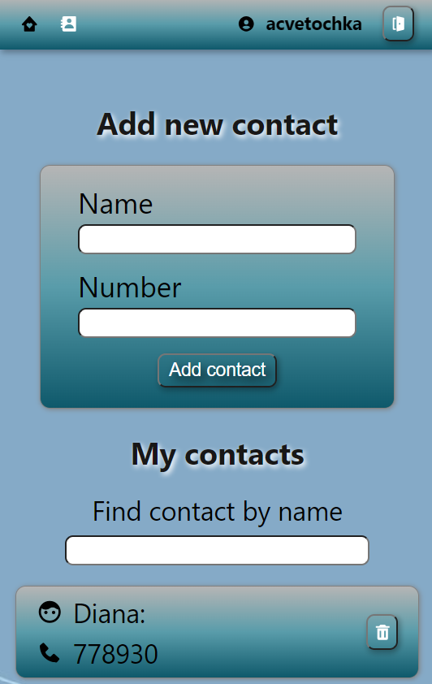

# Phonebook

This is the README file for a web application for storing phone contacts.

## Description

The application allows users to conveniently manage their contacts, including adding, deleting, and filtering by name. We also provide responsive design and an authentication system.

## Links

- You can explore the application at: [Phonebook](https://acvetochka.github.io/Phonebook)

## Application Features

- **Authentication**: Users can authenticate into the system using their email and password.

- **Adding Contacts**: Users can add new contacts, including name, phone number, email address, and other details.

- **Deleting Contacts**: Users can delete contacts that are no longer needed.

- **Name Filtering**: Users can search for contacts by filtering them by name.

     
<!--  -->

- **Responsive Design**: The application has a responsive design, allowing users to use it conveniently on various devices, including computers, tablets, and smartphones.

  - Desktop
    
  

  - Mobile
    
  
<!--  -->

## Used Technologies

  
  
  
  
  
  

  
  

 **Utilities**:

   
   
   

## About the Author
This website was created by Alona Kuznetsova
[Github](https://github.com/acvetochka)
[LinkedIn](https://www.linkedin.com/in/alona-kuznietsova/)
