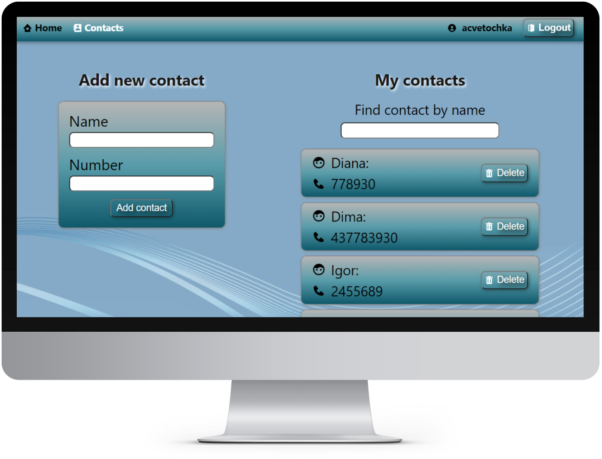
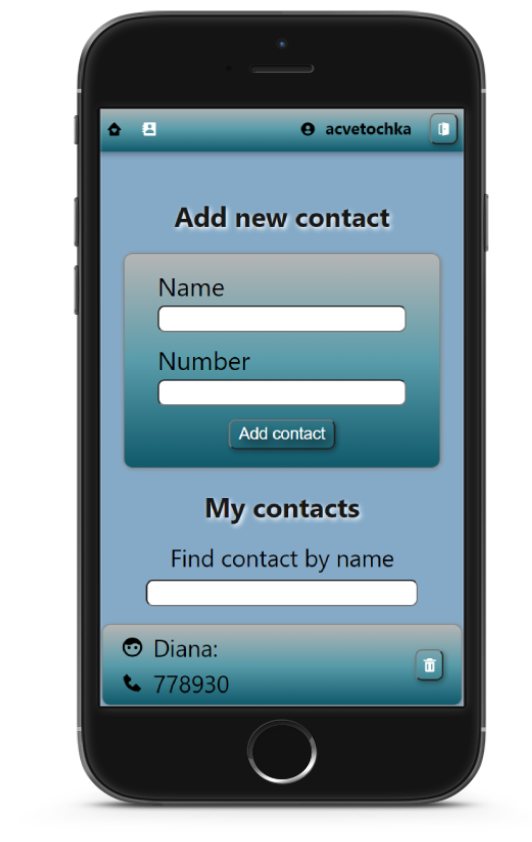

# Phonebook

Це README файл для веб-додатку для зберігання телефонних контактів. 

## Опис 

Додаток надає можливість користувачам зручно управляти своїми контактами, включаючи додавання, видалення та фільтрацію за іменем. Ми також забезпечили адаптивну верстку та систему авторизації.

## Посилання

- З додатком можна ознайомитись за посиланням:  [Phonebook](https://acvetochka.github.io/Phonebook)
- Використовується [Backend](https://github.com/acvetochka/nodejs-rest-api)

## Функціональність додатку

- **Авторизація**: Користувачі можуть авторизуватися в системі, використовуючи свій електронний адрес та пароль.

- **Додавання контактів**: Користувачі можуть додавати нові контакти, включаючи ім'я, номер телефону, адресу електронної пошти та інші реквізити.

- **Видалення контактів**: Користувачі можуть видаляти контакти, які вже не потрібні.

- **Фільтрація за іменем**: Користувачі можуть шукати контакти, фільтруючи їх за іменем.

     

<!--  -->

- **Адаптивна верстка**: Додаток має адаптивний дизайн, що дозволяє користувачам зручно використовувати його на різних пристроях, включаючи комп'ютери, планшети та смартфони.

  - Desktop
    
  

  - Mobile

  

<!--  -->

## Використані технології

  
  
  
  
  
  

  
  

 **Utilites**:

   
   
   

## Про автора
Цей веб-сайт був створений Альоною Кузнєцовою
[Github](https://github.com/acvetochka)
[LinkedIn](https://www.linkedin.com/in/alona-kuznietsova/)
